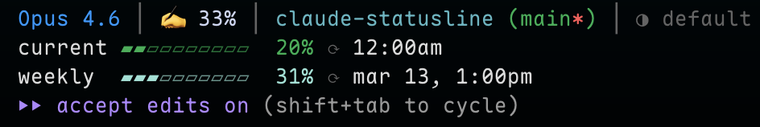

# claude-statusline

A custom status line for Claude Code CLI showing model, context usage, rate limits, effort level, and more. Fork of [@kamranahmedse/claude-statusline](https://github.com/kamranahmedse/claude-statusline) with Catppuccin Mocha colors, compact mode, and session-aware effort detection.



## Install

Add to your Claude Code `settings.json`:

```json
{
  "statusLine": {
    "type": "command",
    "command": "bunx @zynoo/claude-statusline --bar-style shade --usage-style compact"
  }
}
```

## Requirements

- [jq](https://jqlang.github.io/jq/) — for parsing JSON
- curl — for fetching rate limit data
- git — for branch info

On macOS:

```bash
brew install jq
```

## CLI Arguments

| Argument | Values | Default | Description |
|----------|--------|---------|-------------|
| `--cache-ttl` | seconds | `120` | API cache TTL |
| `--bar-style` | `diamond`, `block`, `dot`, `arrow`, `square`, `shade` | `diamond` | Progress bar character style |
| `--usage-style` | `default`, `compact` | `default` | Multi-line or single-line usage |
| `--time-style` | `remaining`, `absolute` | `remaining` | `1h·4m left` vs `12:00am` |

### Bar Styles

| Value | Preview |
|-------|---------|
| `diamond` (default) | `▰▰▰▱▱▱▱▱▱▱` |
| `block` | `████░░░░░░` |
| `shade` | `▓▓▓░░░░░░░` |
| `dot` | `●●●○○○○○○○` |
| `arrow` | `▸▸▸▹▹▹▹▹▹▹` |
| `square` | `■■■□□□□□□□` |

### Usage Styles

**default** — multi-line with rate limit details:
```
Opus 4.6 (1M context) │ ✍️ 12% │ my-project (main) │ ⏱ 1h30m │ ✦ max
current ▓▓▓▓░░░░░░  44% (1h·4m left)
weekly  ▓▓░░░░░░░░  21% (2d·14h left)
```

**compact** — single-line usage:
```
Opus 4.6 (1M context) │ ✍️ 12% │ my-project (main) │ ⏱ 1h30m │ ✦ max
Usage ▓▓▓▓░░░░░░░░ 44% (1h·4m left) │ ▓▓░░░░░░░░░░ 21% (2d·14h left)
```

## Effort Level Detection

Effort level is detected from the session transcript (supports `max`, `xhigh`, `high`, `medium`, `low`), with fallback to `~/.claude/settings.json`. Each level has a distinct icon and color:

| Level | Icon | Color |
|-------|------|-------|
| max | ✦ | Yellow |
| xhigh | ◉ | Pink |
| high | ● | Mauve |
| medium | ◑ | Sapphire |
| low | ◔ | Dim |

## Color Scheme

All colors use the [Catppuccin Mocha](https://github.com/catppuccin/catppuccin) palette:

| Element | Color |
|---------|-------|
| Model name | Peach `#fab387` |
| Directory | Sky `#89dceb` |
| Git branch | Green `#a6e3a1` |
| 5h usage bar | Green `#a6e3a1` |
| 7d usage bar | Blue `#89b4fa` |
| Empty bar | Surface 0 `#313244` |

## Credits

Based on [claude-statusline](https://github.com/kamranahmedse/claude-statusline) by [Kamran Ahmed](https://github.com/kamranahmedse). Thanks for the great work!

## License

MIT — see [LICENSE](./LICENSE) for details.
