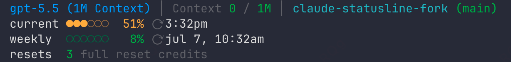

# claude-statusline

Configure your Claude Code statusline to show limits, directory, git info, reasoning effort and the skills a session has used



## Install

Run the command below to set it up

```bash
npx @kamranahmedse/claude-statusline
```

It backups your old status line if any and copies the status line script to `~/.claude/statusline.sh` and configures your Claude Code settings.

## Skills block

Off unless you ask for it, so upgrading does not change your status line.
Create `~/.claude/statusline.json`:

```json
{
  "skills": true,
  "skills_limit": 3
}
```

```
Opus │ ✍️ 25% │ my-repo (main) │ ◕ xhigh │ ✦ code-review,artifact-design,dataviz +2
```

`skills_limit` is how many names are shown, 1 to 10, 3 by default; the rest
become the `+N`. The `{"blocks": [..., "skills"]}` form used by
[mpiton/claude-statusline](https://github.com/mpiton/claude-statusline) is
accepted too, so a config written for either works.

Claude Code sends no skill list on stdin, so the names come from the session
transcript: a `Skill` tool call, or a slash command whose name matches an
installed skill or plugin command. That makes it skills the session invoked,
in the order it first invoked them, not skills available to it. Invocations
inside a subagent are not counted. Only the bytes appended since the last
render are read, so the block costs the same however long the session runs.

## Requirements

- [jq](https://jqlang.github.io/jq/) — for parsing JSON
- curl — for fetching rate limit data
- git — for branch info

On macOS:

```bash
brew install jq
```

## Uninstall

```bash
npx @kamranahmedse/claude-statusline --uninstall
```

If you had a previous statusline, it restores it from the backup. Otherwise it removes the script and cleans up your settings.

## License

MIT
